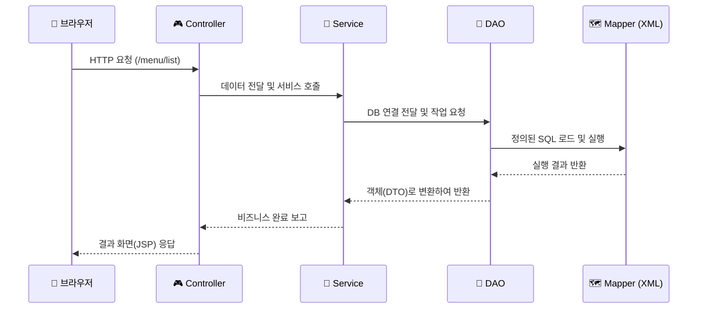

# 🛵 배달의 민족 사장님 광장 - 팀원을 위한 코드 가이드

<div align="center">
  
  <br/>
  <h3>"자바? 서블릿? 이게 다 뭔가요?"</h3>
  <p>이 문서는 코딩이 낯선 팀원들이 프로젝트의 <b>모든 코드</b>를 한 줄도 빠짐없이 이해할 수 있도록 작성된 <b>친절한 해설서</b>입니다.<br>
  Github 메인화면(README)에서 바로 읽으시면 됩니다.</p>
</div>

---

## 📚 목차
1.  **💡 시작하기 전에: 필수 개념 (기술 분석)**
2.  **🏗️ 아키텍처 상세 설계 (Mapper-DAO-Service-Controller)**
3.  **✨ 주요 기능 소개**
4.  **🚀 데이터 흐름 (Data Flow)**
5.  **🔎 소스 코드 상세 분석**
    *   [5-1. 데이터 모델 (DTO)](#5-1-데이터-모델-dto)
    *   [5-2. 비즈니스 로직 (Service)](#5-2-비즈니스-로직-service)
    *   [5-3. 데이터 접근 (DAO)](#5-3-데이터-접근-dao)
    *   [5-4. 컨트롤러 (Controller)](#5-4-컨트롤러-controller---servlet)
    *   [5-5. 화면 및 템플릿 엔진 (JSP/JSTL)](#5-5-화면-및-템플릿-엔진-jsp-jstl-el)
6.  **🧠 심화 개념 및 마무리**

---

## 1. 💡 시작하기 전에: 필수 개념 (기술 분석)

| 용어 | 기술적 설명 |
| :--- | :--- |
| **클래스(Class)** | 데이터와 기능을 묶은 **설계도**. 자바 파일(`.java`) 하나가 곧 하나의 클래스입니다. |
| **인스턴스(Instance)** | 설계도를 바탕으로 **메모리에 생성된 실체**. `new` 키워드로 만듭니다. |
| **AJAX** | 화면 전환 없이 백그라운드에서 데이터를 주고받는 **비동기 통신** 기술입니다. |
| **MVC 패턴** | 코드를 **Model**(데이터), **View**(화면), **Controller**(조정자)로 나눠 짜는 규칙입니다. |
| **트랜잭션** | 여러 DB 작업을 하나로 묶는 단위. 모두 성공하면 **Commit**, 하나라도 실패하면 **Rollback**. |

---

## 2. 🏗️ 아키텍처 상세 설계 (Layered Architecture)

우리 프로젝트는 역할에 따라 4개의 계층으로 코드를 분리하여 관리합니다.

### 🎨 데이터 처리 흐름도


### 🏛️ 계층별 역할 요약
*   **🎮 Controller (안내데스크)**: 사용자의 요청을 받고, 서비스에 일을 시킨 뒤, 결과를 어떤 화면에 보여줄지 결정합니다.
*   **💼 Service (감독관)**: 실제 업무 로직을 수행하며, DB 작업이 안전하게 완료되었는지(Transaction) 확인합니다.
*   **📂 DAO (현장일꾼)**: 실제 DB에 들어가서 데이터를 가져오거나 넣는 일을 수행합니다.
*   **🗺️ Mapper (작업지시서)**: 자바 코드에서 SQL을 분리하여 XML 파일에 따로 적어둔 쿼리 보관소입니다.

---

## 3. ✨ 주요 기능 소개
*   **메뉴 통합 관리**: 등록, 수정, 삭제가 한 화면에서 모달로 처리됩니다.
*   **고도화 검색 및 정렬**: 이름/가격순 조합 정렬 및 실시간 필터링을 지원합니다.
*   **상태 유지 AJAX**: 검색 결과 페이지에서도 새로고침 없이 모든 동적 기능을 유지합니다.

---

## 4. 🚀 데이터 흐름 (Data Flow)
1.  **Client**: `fetch()` API로 서버에 데이터 요청.
2.  **Controller**: 요청 파라미터를 읽어 `MenuDTO` 객체 생성.
3.  **Service**: `JDBCTemplate`으로 DB 통로를 열어 DAO에 전달.
4.  **DAO**: Mapper XML에서 쿼리를 읽어와 DB 실행.
5.  **Response**: 처리 결과를 "success" 문구로 응답하거나 목록 HTML 조각을 전송.

---

## 5. 🔎 소스 코드 상세 분석

### 5-1. 데이터 모델 (DTO - Data Transfer Object)
데이터를 한꺼번에 실어 나르는 **'상자'** 역할을 합니다.
```java
public class MenuDTO {
    private int menuCode;        // 메뉴 번호
    private String menuName;     // 메뉴 이름
    private int menuPrice;       // 가격
    private int categoryCode;    // 카테고리
    private String orderableStatus; // 판매여부
    // ... Getter/Setter 생략 ...
}
```

### 5-2. 비즈니스 로직 (Service)
일관성 있는 작업을 보장하는 **'트랜잭션'**의 중심입니다.
```java
public int registMenu(MenuDTO menu) {
    Connection con = JDBCTemplate.getConnection();
    int result = menuDAO.insertMenu(con, menu);
    if (result > 0) JDBCTemplate.commit(con); // 성공 시 확정
    else JDBCTemplate.rollback(con);          // 실패 시 취소
    JDBCTemplate.close(con);
    return result;
}
```

### 5-3. 데이터 접근 (DAO)
SQL 쿼리를 실행하고 데이터를 객체에 담는 **'매핑'**을 담당합니다.
```java
String query = prop.getProperty("selectMenusWithFilter");
pstmt = con.prepareStatement(query);
pstmt.setString(1, searchQuery); // 파라미터 바인딩
rset = pstmt.executeQuery();
while (rset.next()) {
    // DB 결과를 DTO에 하나씩 담기
}
```

### 5-4. 컨트롤러 (Controller - Servlet)
웹 주소와 자바 코드를 연결하는 **'매핑 포인트'**입니다.
- `@WebServlet("/menu/*")`: `/menu`로 들어오는 모든 요청을 처리합니다.
- `req.getParameter()`: 사용자가 입력한 데이터를 읽어옵니다.

### 5-5. 화면 및 템플릿 엔진 (JSP, JSTL, EL)
- **EL (`${...}`)**: 자바 변수를 화면에 쉽게 출력합니다.
- **JSTL (`<c:forEach>`)**: 목록 데이터를 반복해서 출력하는 태그형 문법입니다.

---

## 6. 🧠 심화 개념 및 마무리
*   **History API**: URL을 변경하면서도 페이지는 유지하는 기술로 사용자 경험을 극대화했습니다.
*   **동적 쿼리**: 하나의 SQL로 다양한 필터 조건을 모두 처리하는 고급 기법을 적용했습니다.

> **🚀 팀원분들께**  
> 우리 프로젝트는 "누가 봐도 이해하기 쉬운 코드"를 지향합니다. 구조가 잡혀있으므로 새로운 기능을 추가할 때 기존 코드를 참고하면 누구나 쉽게 확장할 수 있습니다. 화이팅입니다! 💖
